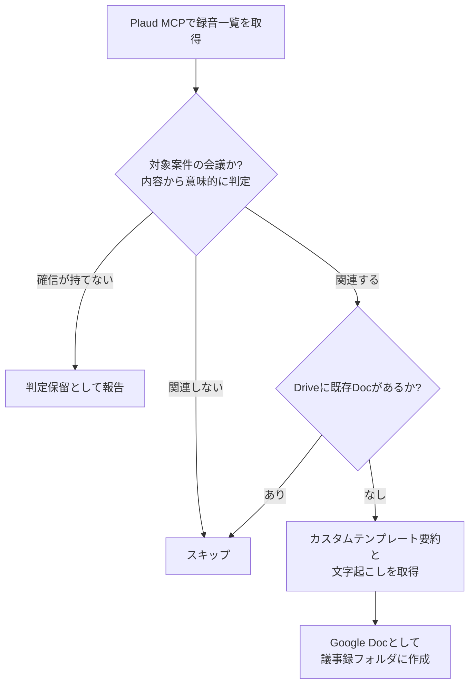

:::message
この記事はAIとの共著です。
:::

こんにちは！[@Ryo54388667](https://x.com/Ryo54388667)です！☺️

普段は都内でエンジニアとして業務をしてます！最近はプロジェクトをインフラからバックエンド、フロントエンドまで一通り任せてもらっています。

今回は **AIボイスレコーダー「Plaud Note Pro」でシステム開発の顧客ミーティングを効率化した話** を紹介していきます！

## 📌 はじめに

受託のシステム開発では、顧客との要件定義ミーティングが頻繁にあります。ここで地味に辛いのが議事録です。私の場合、導入前は次のような課題を抱えていました。

- 「話を聞く」「要件の詳細を質問する」「議事録をとる」のマルチタスクが辛い
- 文字起こしをそのまま共有しても、テキストが長すぎて誰も読まない。しかも営業・プロジェクトマネージャー・開発者で気にする箇所がそれぞれ違う
- システムの仕様変更が出たとき、遡って「いつ・誰が・何を決めたか」を確認するのが大変
- 議事録をドキュメントとして Google Drive に保存したい

この記事では、これらの課題をPlaud Note Proでどう解決したかを、次の3本柱で紹介します。

1. Plaud Note Proでミーティングの議事録をとる
2. Plaudアプリのtips（カスタム用語・要約テンプレート）
3. Plaud MCPを利用した効率化

## 📌 Plaud Note Proとは？

[Plaud Note Pro](https://jp.plaud.ai/) は、録音から文字起こし・AI要約までを1台で行えるカード型のAIボイスレコーダーです。

**主な特徴**

- 録音した音声をアプリで文字起こし（112言語対応・話者ラベル付き）
- 要約テンプレートによるノートの自動生成
- カスタム用語の登録で専門用語の誤変換を軽減
- 極薄のカード型で、会議の机に置くだけで使える

料金プランは無料の「Starter」（月300分の文字起こし）から有料の「Pro」「Unlimited」まであります。私は現在Starterプランで運用しており、ミーティングが多くて足りない月は「追加600分」のような文字起こし分数の追加パッケージを都度購入しています。月によって会議量が変動する受託開発だと、サブスクに上げる前にこの運用で様子を見るのがちょうどよかったです！

[Plaud Note Pro をAmazonで見る](https://af.moshimo.com/af/c/click?a_id=2351007&p_id=170&pc_id=185&pl_id=27060&url=https%3A%2F%2Fwww.amazon.co.jp%2Fdp%2FB0FQ5J7HFQ)
（アフィリエイトリンクです）

## 📌 1. ミーティングの議事録をとる

### 対面ミーティング: 録音ボタンを押して置くだけ

対面の打ち合わせでは、本体の録音ボタンを押して机に置くだけです。操作がこれだけなので、会議の冒頭で相手を待たせることがありません。

**ポイントは物理ボタンでマーカーを付けること**です。要件の重要な発言が出たタイミングで本体のボタンを1度押すと、その位置にマーカーが付きます（Note Proの標準機能）。後から文字起こしを見返すとき、マーカー箇所が要約上でもハイライトされるので、「どこが大事だったか」を探す時間がほぼなくなります。

### オンライン会議: Desktopアプリが自動で録音

意外と知られていない気がしますが、オンライン会議では本体を使っていません。PCで **Plaud Desktopアプリ** を常駐させておくと、Web会議の開始を検知して自動で録音が始まります。「録音ボタンを押し忘れて会議が終わっていた」という事故がなくなるので、オンライン会議が多い方にはこの運用がおすすめです！

実際、私の録音一覧を見ると対面録音よりデスクトップ録音のほうが圧倒的に多くなっていました。

### iPhoneのボイスメモと比べてみた

「文字起こしだけならiPhoneのボイスメモでもできるのでは？」と思う方もいるはずです。実は、たまたま同じ会議をiPhoneボイスメモとPlaud Note Proの両方で録音していたことがあり、比較ができました。

| 観点 | iPhoneボイスメモ | Plaud Note Pro |
| ---- | ---- | ---- |
| 話者ラベル | なし（全発言が1つの塊） | あり（発言者ごとに分離） |
| タイムスタンプ | ほぼなし | 発言ごとに付与 |
| 文の形 | 分かち書きで句読点がほぼない | 句読点付きの整った文 |
| 固有名詞 | 人名・専門用語の誤変換が目立つ | カスタム用語登録で正しく変換 |

同じ冒頭のあいさつ部分を並べるとこうなります（固有名詞は伏せています）。

iPhoneボイスメモの文字起こしは次のとおりです。

> あ え 彼 が 〇〇 開発 の 〇〇 です 。 よろしく お 願い し ます 。 です ね 。 あ 、 ×× 様 はい 。 すい ませ ん 、 この 前 僕 、 名刺 渡し て なかっ た な と 思っ て 。

Plaud Note Proの文字起こしは次のとおりです。

> 00:00:01 〇〇（筆者）
> 〇〇です。開発の〇〇です。よろしくお願いします。××さんですね。
> 00:00:06 Speaker 1
> あ、××様。この前僕、名刺渡してなかったなと思って。

iPhone側では、顧客担当者の姓が全く別のカタカナ語に化けていました（しかも2パターン😅）。一方Plaud側は、後述するカスタム用語に登録していたため正しく変換されています。

録音するだけならどちらでもできます。ただ、**議事録の材料になるかどうか**は話者ラベルとタイムスタンプの有無で決まります。誰の発言か分からない文字起こしからは、AIも「誰のタスクか」を判定できないからです。

## 📌 2. Plaudアプリのtips

### カスタム用語は「単語帳」ではなく「文脈の提供」として使う

Plaudアプリにはカスタム用語の登録機能（Beta）があります。私は次のような方針で12件登録しています。

- **社名・人名は読み仮名と所属を添えて登録する**
  - 例: `人物: 〇〇（読みがな）さん（顧客側）`、`株式会社〇〇（読みがな）`
- **誤変換されやすい業務用語を登録する**
  - 例: `天引き（てんびき）`、`突合（とつごう）`、`預り金（あずかりきん）`
- **業界の選択**（全体設定）も設定しておく。AIが分野を理解しやすくなります

ポイントは、単語をそのまま並べるのではなく「人物:」のようなプレフィックスや所属・案件名まで書くことです。文字起こしAIへの単語帳というより、**会議の文脈を事前に教えておく**イメージで書くと、人名や同音異義語の変換精度が体感で大きく変わります！

### 要約テンプレートは「読み手別」に2枚作る

冒頭の課題に「読む人によって気にする箇所が違う」と書きました。これに対する私の答えが、**同じ録音から読み手別の要約を出し分ける**ことです。Plaudアプリでは要約テンプレートを自作できるので、次の2枚を登録しています。

**1枚目: 要件定義MTG（社内詳細版）**

会議に出ていない開発メンバー向けの詳細議事録です。目的は「言った・言わない」の争いを起こさないこと。出力セクションは次の構成に固定しています。

- 会議情報（日付・参加者・目的）
- 決定事項（表形式: 決定内容・理由・承認した人。仕様変更には【仕様変更】プレフィックス）
- 未決事項（論点・保留理由・次のアクション）
- アクションアイテム（自社側と顧客側で表を分ける）
- スコープ整理（**「やらない」と決めたことも記録する**）
- 要件メモ（機能要件・非機能要件に分類）
- 前提条件・制約
- 顧客の懸念・要望の生の声
- 次回に向けて
- 認識齟齬リスク（AIによる指摘・最大5件）

あわせて、テンプレートのプロンプトに次のような厳守ルールを書いています。要約AIのハルシネーション対策としてかなり効きます。

- 会話に出ていない情報を推測で補わない。期日や数値は発言されたものだけを書き、なければ「期限未設定」と書く
- 「[氏名を挿入]」のようなプレースホルダーを出力しない。情報がなければ「言及なし」とする
- 実名が特定できない話者は「顧客側」「開発側」と立場で書き、Speaker番号のままアクションアイテムの担当者にしない
- 曖昧な合意（「たぶん」「一旦」「検討します」）は決定事項ではなく未決事項に入れる

**2枚目: 要件定義MTG（客先共有版）**

顧客にそのまま送って内容を相互確認するための1枚ものです。こちらは「顧客が3分で読み切れる」ことを最優先に、です・ます調で、決定した事項・継続検討となった事項・宿題事項（担当は御社/弊社）だけに絞っています。末尾には「認識の相違があればご指摘ください。ご返信をもって議事内容の確認とさせていただきます」という固定文を出力させて、議事録確認の依頼まで一体化しています。

テンプレート自体は、背景（Context）→目的（Objective）→文体（Style/Tone）→読み手（Audience）→厳守ルール（Rules）→出力フォーマット（Response format）の順で書いています。プロンプトエンジニアリングの定石の構成ですが、Plaudのテンプレートにもそのまま通用しました。

## 📌 3. Plaud MCPを利用した効率化

ここまでの話とこれからの話を1枚にまとめると、全体像はこうなります。

### Plaud MCPでできること

Plaudは[公式のMCPサーバー](https://docs.plaud.ai/plaud-mcp-cli/mcp)を提供しています。Claude CodeなどのMCPクライアントから接続すると、次のツールが使えます。

- `list_files`: 録音一覧の取得
- `get_note`: AI要約ノートの取得
- `get_transcript`: 話者ラベル付き文字起こしの取得
- `get_file`: 録音ファイルの詳細取得

つまり、**録音・文字起こし・要約をAIエージェントの入力として直接扱える**ようになります。ここから先は「Plaudが作った素材をどう料理するか」の世界ですね。

### 議事録をGoogle Driveに自動保存する

冒頭の課題の「議事録をGoogle Driveに保存したい」は、Claudeのスケジュールタスク（ルーティーン）として実装しました。Plaud MCPとGoogle Driveコネクタを組み合わせて、次の流れを1つのプロンプトにしています（現在は必要なタイミングで都度実行しています）。

プロンプト設計で効いたポイントを紹介します。

**1. 重複防止は二段構えにする**

作成するDocの本文に録音IDを埋めておき、実行時はまずDrive内をそのIDで全文検索します。ヒットしなければ、録音日をタイトルに持つDocを検索して同一会議かを判断します。これで手動作成したDocがあってもすり抜けません。

**2. 対象案件の判定は「表記揺れ+文脈」で行う**

文字起こし上の案件名・社名は表記が揺れます（英字・カナ・別表記）。そこで社名の一致だけでなく、案件内容や登場人物といった文脈からも判定させます。そして**確信が持てない録音はDocを作らず「判定保留」として報告**させます。勝手に作られるより、報告してもらって人間が判断するほうが運用は安定します。

**3. 要約ソースはフォールバックを用意する**

前述のカスタムテンプレート「社内詳細版」の要約を最優先で使い、取得に失敗した場合は既定のSummaryにフォールバックさせます。どちらを使ったかもDocのメタ情報に記録します。

**4. 実行結果は全件分類で報告させる**

処理した録音を「新規作成/処理済み/対象外/判定保留」に分類して列挙させると、取りこぼしの有無が一目で分かります。

これで、ミーティング後に「文字起こしを整形して、要約して、ドキュメントにしてDriveに保存」という手作業がまるごと不要になりました！

### 今後: 開発タスクへの整理まで自動化したい

次にやりたいのは、会議で出た要望や決定事項を開発タスク（IssueやTODO）に整理するところまでの自動化です。カスタムテンプレートの要約にはアクションアイテムが担当・期限付きで構造化されているので、素材はすでに揃っています。

## 📌 注意点

実際に運用して引っかかったポイントです。

- **充電端子が特殊**: Note Pro本体の充電端子はUSB Type-Cではありません。専用ケーブルを忘れると充電できないので、持ち歩きセットに入れておくのがおすすめです
- **無料枠の管理**: Starterプランは月300分です。私は月末に300分を使い切ってしまい、大事な会議の前に慌てて追加パッケージを買ったことがあります😅。会議が多い月は残り分数を早めに確認しておきましょう
- **録音まわりの基本**: 対面では録音開始の押し忘れ、オンラインではDesktopアプリが起動しているかの確認は習慣にしておくと安心です

また、顧客との会議を録音する際は、必ず冒頭で録音の許可を取りましょう。私は「議事録作成のためだけに利用します」と用途を添えて確認しています。

## 📌 まとめ

Plaud Note Proを導入した結果：

- **議事録作成がほぼゼロに**: 導入前は1回のミーティングにつき30分〜1時間かけていた議事録作成・共有が、生成結果の確認だけになりました
- **会議に集中できる**:「聞く・質問する・記録する」のマルチタスクから解放され、要件の深掘りに集中できます
- **読み手別の議事録**: カスタムテンプレート2枚（社内詳細版/客先共有版）で、同じ録音から読み手に合った要約を出し分けられます
- **カスタム用語で精度が上がる**: 人名は読み仮名+所属まで登録するのがコツです
- **MCPで議事録フローごと自動化**: Plaud MCP × Claudeで、案件の会議を自動判定してGoogle DriveにDoc保存するところまで仕組み化できました

議事録作成に時間を取られている方の参考になれば幸いです！

最後まで読んでいただきありがとうございます！

気ままにつぶやいているので、気軽にフォローをお願いします！🥺

## 📌 参考資料

- [Plaud Note Pro 日本公式ストア](https://jp.plaud.ai/)
- [Plaud AI Plan Pricing（料金プラン）](https://www.plaud.ai/pages/plaud-ai-plan-pricing)
- [Plaud MCP - Plaud Dev API](https://docs.plaud.ai/plaud-mcp-cli/mcp)
- [Plaud Device Comparison（Note/Note Pro/NotePin 公式比較）](https://www.plaud.ai/pages/plaud-device-comparison)
